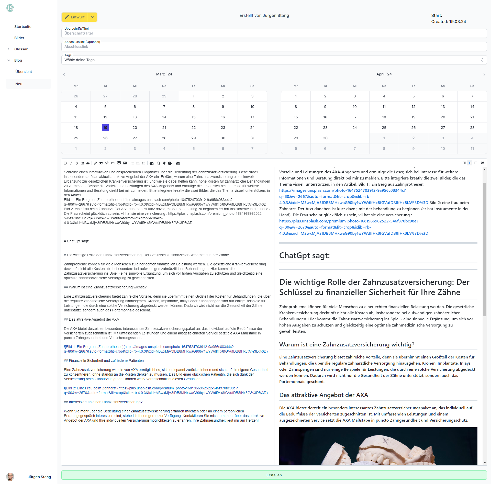

# Willkommen im digitalen Abenteuerland! 👋

  

🚀 Als leidenschaftlicher Webentwickler mit einem ungewöhnlichen Hintergrund in der Altenpflege bringe ich einzigartige Soft Skills mit, die meine technische Arbeit bereichern.

💼 Mit einem Fokus auf **NextJS** und **TypeScript** strebe ich danach, Clean Code zu schreiben und Anwendungen zu entwickeln, die nicht nur funktional, sondern auch reaktionsfreudig sind. Meine Reise als Hobbyprogrammierer hat mir ein tiefes Verständnis für die Best Practices in der Webentwicklung verliehen.

---

## 🛠️ Technische Fähigkeiten

- **Frontend**: ReactJS, NextJS, VueJS, NuxtJS
- **Backend**: ExpressJS
- **Testing & Optimierung**: Erfahrungen mit AB-Testing und Kameleoon, um datengesteuerte und benutzerzentrierte Lösungen zu schaffen.

---

## 💡 Ziele

Mein Ziel ist es, innovative Webanwendungen zu entwickeln, die nicht nur benutzerfreundlich, sondern auch leistungsstark sind. Dabei strebe ich stets danach, einen bleibenden Eindruck zu hinterlassen und das Nutzererlebnis zu verbessern.

Als begeisterter Anhänger der Naturwissenschaften, ist es meine Leidenschaft, diese in meine Projekte zu integrieren. Durch Projekte wie Math-Algorithm-Solutions versuche ich, eine Brücke zwischen theoretischer Mathematik und praktischer Softwareentwicklung zu schlagen, indem ich umfangreiche Sammlungen von mathematischen Algorithmen in nutzbare Anwendungen umwandle.

---

## 🔥 Projekte

### [Versicherungen-Stang](https://dev.versicherungen-stang.de)

Versicherungen-Stang ist ein umfassendes Projekt für einen Versicherungsmakler, das eine Website für Jürgen Stang bietet. Das Projekt umfasst Frontend, Backend und ein Content Management System (CMS), das es Jürgen ermöglicht, die Inhalte der Website zu verwalten.

**Highlights**:

- **All-in-One-Lösung**: Enthält Frontend, Backend und ein leistungsfähiges CMS für eine nahtlose Verwaltung von Inhalten.
- **Direkte Interaktion**: Besucher können direkt Termine über Google Kalender buchen und Nachrichten über das Kontaktformular senden.
- **Content Management**: Jürgen kann Blogs im Markdown-Format im CMS verfassen und veröffentlichen sowie ein Glossar mit Fachbegriffen pflegen. Die Erstellung von Blogartikeln wird durch die Integration von ChatGPT 3.5 unterstützt, um den Content zu optimieren.
- **Technologie**: Das Frontend und CMS sind in Next.js mit TypeScript und Tailwind CSS geschrieben, während das Backend auf Express.js basiert.

**Technologien**:

- **Next.js & TypeScript**: Für das Frontend und CMS, um eine hohe Leistung und Codequalität sicherzustellen.
- **Tailwind CSS**: Zur Gestaltung der Benutzeroberfläche und Bereitstellung responsiver Designs.
- **Express.js**: Das Backend-Framework für die Logik und Datenverarbeitung.
- **ChatGPT 3.5**: Integriert für die Erstellung von Blogartikeln und die Optimierung von Inhalten.
- **MongoDB & Mongoose**: Zur Speicherung und Verwaltung von Daten.
- **Nodemailer**: Zur Behandlung von Kontaktformularnachrichten und anderen E-Mails.
- **Google API & Cloud Storage**: Zur Integration von Google Kalender und Speicherung von Medien.

**CMS-Einblicke: Gestaltung von Inhalten mit ChatGPT**

Ein Screenshot aus dem Content Management System (CMS) der Website "Versicherungen-Stang" veranschaulicht, wie Inhalte mit Unterstützung durch ChatGPT erstellt werden:

**Kernpunkte der CMS-Nutzung:**

- **Entwurfsmodus**: Artikel werden als Entwürfe gestartet, die vor der öffentlichen Freigabe auf Genauigkeit überprüft werden können.
- **Content-Strukturierung**: Der Nutzer hat Zugriff auf Felder für Überschrift, optionale Abschlusslinks und Tags, die aus einem Dropdown-Menü ausgewählt werden können, um den Inhalt zu klassifizieren.
- **Veröffentlichungsplanung**: Ein Kalender erlaubt das Festlegen von Veröffentlichungs- und Enddaten.
- **ChatGPT-Integration**: Ermöglicht das Verfassen, Verbessern von Texten, Einholen kreativer Ideen oder Formulieren freier Prompts direkt im CMS. Dies steigert die Effizienz und Kreativität bei der Content-Erstellung.

Diese Funktionen erleichtern die Erstellung ansprechender und informativer Inhalte, indem sie auf die kreative und sprachliche Stärke von ChatGPT zurückgreifen, was die Content-Qualität und das Benutzererlebnis auf "Versicherungen-Stang" deutlich verbessert.

---

## 📫 Kontakt

Lass uns vernetzen! Für Projektanfragen, Fragen oder zum Austausch erreichst du mich hier auf GitHub oder auf den gängigen Socialmedia-Kanälen.
  
